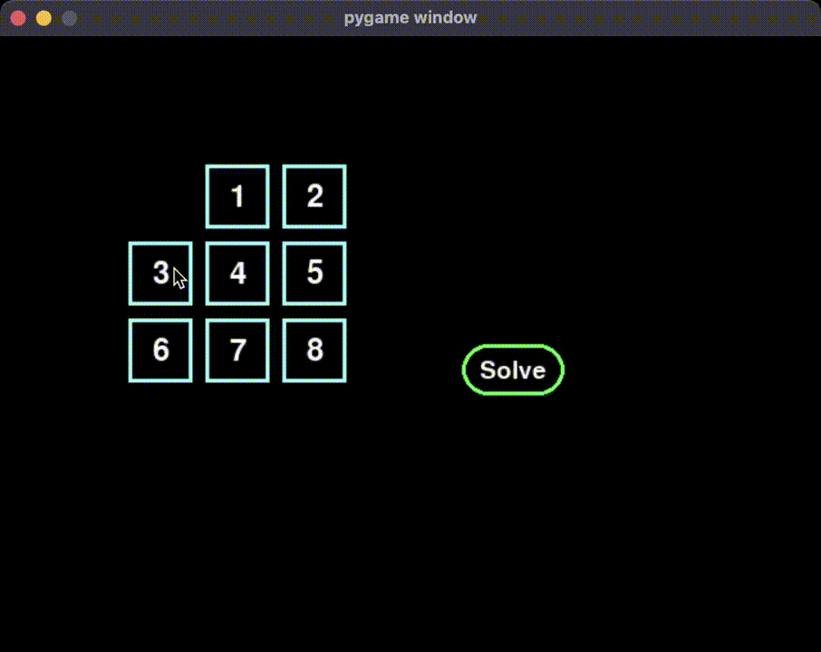

# 8-Puzzle-Solver

An interactive program for "8 puzzle" game with AI search-based solvers. Below is a short demo about the program

Currently the following solvers are supported:
- Depth first search.
- A star search based on the manhattan distance heuristic.

# Get started

Pull the code to your local directory. You can use the following command

`git clone https://github.com/mohammedElfatihSalah/8-Puzzle-Solver.git`

Then install dependencies (only pygame for now) :

`pip install -r requirements.txt`

Finally you can run the program using the following command:

`python main.py`

Enjoy :)

# Future Features & Collaborations:
- Implement radio buttons to select between different solvers.
- Implement hint feature to show the user the next move only
- Add a pause feature so the user could stop solvers and continue to solve by themselves.

